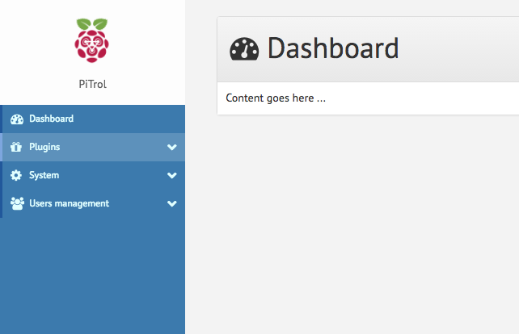

[](https://travis-ci.org/Lamassau/PiTrol)
[](https://coveralls.io/github/Lamassau/PiTrol?branch=master)
[](https://greenkeeper.io/)
[](http://standardjs.com)
[](https://gitter.im/PiTrolx/)
[](https://opensource.org/licenses/MIT)

<div align="center">
  
</div>

# PiTrol
PiTrol is a project that allows you to monitor and control your Raspberry Pi over a web browser.

## Screenshots



## Usage
1. Check out a copy of the project
  ```bash
    $ git clone https://github.com/Lamassau/PiTrol && cd PiTrol
  ```

2. Install all dependencies
  ```bash
    npm install
  ```

3. Build to 'build' directory
  ```bash
    npm run build
  ```

4. Start the app
  ```bash
    node server
  ```

## How to Contribute
Have a feature in mind you'd like to add to the project? Send a pull request

Want a feature that you don't quiet know how to implement? Place an issue

## Authors
[Fadi Hanna Al-Kass] (https://github.com/alkass)

## Contributors
Our list of contributors contains everyone who has ever invested time or resources into the project. Check it out [here](CONTRIBUTORS.md)
